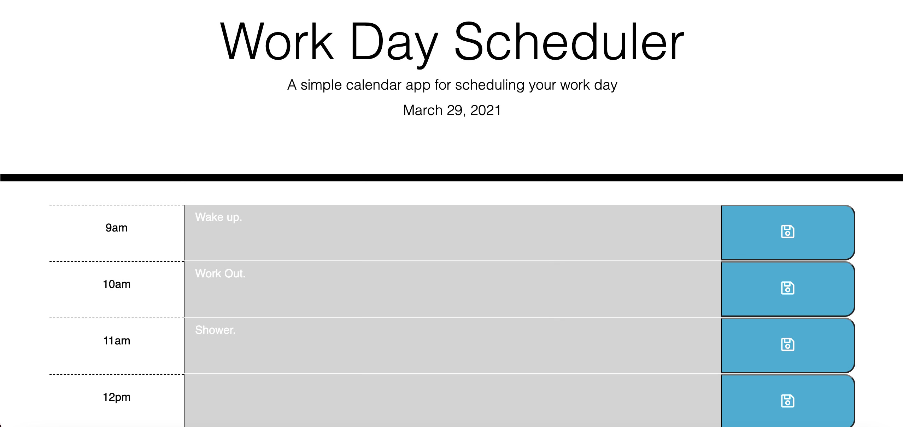

# Work Day Scheduler

## User Story:
As an employee with a busy schedule I want to add important events to a daily planner so that I can manage my time effectively.

## Web Application:
This application is a  daily planner that is used to create a schedule. When a user opens the planner:
1.) They see the current day displayed at the top of the calendar.
2.) When they  scroll down they are presented with time blocks for standard business hours.
3.) When they view the time blocks for that day, each time block is color-coded to indicate whether it is in the past, present, or future.
4.) When they click into a time block they can enter an event, click the save button for that time block and text for that event is saved in local storage.
5.) When they refresh the page the saved events persist.

## Link to the Live Application:
https://jonathan-goldstein.github.io/Work-Day-Scheduler/
## The landing page:

